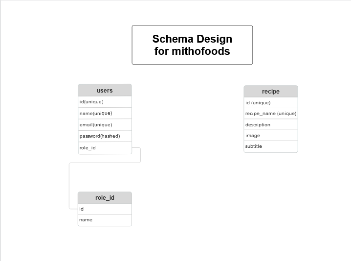

# MithoFoods Web Application

MithoFoods is a web application that connects users to delicious recipes, offering a clean user interface for browsing and managing recipes. The application is built using HTML, CSS, and JavaScript for the frontend and Laravel for the backend.

---

## Note

The backend repo for recipe may not open. Please consider this repo for backend access
`https://github.com/JoyeshShrestha/Recipe-Blog.git`

## Table of Contents

- [Overview](#overview)
- [Features](#features)
- [Technologies Used](#technologies-used)
- [Setup and Installation](#setup-and-installation)
  - [Frontend](#frontend)
  - [Backend](#backend)
- [Usage](#usage)
- [Project Structure](#project-structure)
- [Database Design](#database-design)

---

## Overview

MithoFoods provides an intuitive platform for users to explore and manage recipes. Users can:

- Browse recipes with a clean and responsive interface.
- Manage user profiles and settings.
- Update passwords securely.

The app is divided into two parts:

- **Frontend**: Built with HTML, CSS, and JavaScript.
- **Backend**: Powered by Laravel, providing a robust and scalable framework for handling API requests and database interactions.

>)


---

## Features

- **Responsive Design**: Optimized for desktops, tablets, and mobile devices.
- **Secure Authentication**: User login and password management.
- **Dynamic Content**: Seamlessly integrates backend data with the frontend.
- **Interactive UI**: Smooth user experience with JavaScript functionality.

---

## Technologies Used

### Frontend:

- HTML
- CSS
- JavaScript

### Backend:

- Laravel (PHP framework)

---

## Setup and Installation

Follow these steps to set up the application on your local machine.

### Frontend

1. **Navigate to the Frontend Directory**  
   The frontend files are located in the `frontend/` directory.

2. **Install Live Server Extension**  
   Ensure you have the Live Server extension installed in your code editor (e.g., VS Code).

3. **Run the Frontend**  
   Right-click on `index.html` and select **Open with Live Server**. The frontend will run on port `5500`.

---

### Backend

1. **Install PHP and Composer**  
   Make sure PHP and Composer are installed on your system.

   - [Download PHP](https://www.php.net/downloads)
   - [Download Composer](https://getcomposer.org/download/)

2. **Clone the Repository**

   ```bash
   git clone https://github.com/your-username/mithofoods.git
   cd mithofoods/backend
   ```

3. **Install Laravel Dependencies**

   ```bash
   composer install
   ```

4. **Configure Environment**
   Create a `.env` file in the `backend/` directory based on the `.env.example` file. Set up your database and other environment configurations.

5. **Run Migrations**

   ```bash
   php artisan migrate
   ```

6. **Run the Backend**
   Start the Laravel server:
   ```bash
   php artisan serve
   ```
   The backend will run on port `8000`.

---

## Usage

1. Start the backend server:

   ```bash
   php artisan serve
   ```

   Make sure the server is running on `http://127.0.0.1:8000`.

2. Open the frontend:

   - Navigate to the `frontend/` directory.
   - Right-click on `index.html` and choose **Open with Live Server**.
   - Access the frontend on `http://127.0.0.1:5500`.

3. Interact with the application and explore its features.

4. Open `http://127.0.0.1:8000/api/documentation` for **Swagger Docmentation**

---

## Project Structure

```
mithofoods/
│
├── frontend/
│   ├── css/
│   ├── js/
│   ├── index.html
│   ├── dashboard.html
│   ├── profile.html
│   ├── recipe.html
│   ├── recipeDetails.html
│   ├── users.html
│   ├── changepassword.html
│
├── Recipe/
│   ├── app/
│   ├── config/
│   ├── database/
│   ├── routes/
│   ├── .env
│   ├── artisan
│
├── README.md
```

---

## Database Design



---
